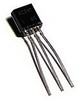
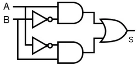
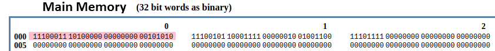

<style>
body {
text-align: justify}
</style>

# **Séquence 1**
# II. L'architecture matérielle des ordinateurs
---

## Cours

### A. Les circuits



Un ordinateur fonctionne avec des `0` et des `1`, qu'il faut représenter de manière physique. Avant d'utiliser des transistors, les ordinateurs étaient équipés de tubes à vide (tous deux sont des composants électroniques). L'apparition des **transistors** a permis de miniaturiser les machines. Dans les différents cas, le passage d'un courant représente le `1`, alors que l'absence de courant représente le `0`.


Les transistors peuvent aujourd'hui être aussi petit que 10 nanomètres, on ne les distingue pas à l'oeil nu. Ils sont agencés les uns à côté des autres et reliés sur des **circuits intégrés**. Les circuits les plus simples sont les **circuits logiques**, faits à partir de **portes logiques** qui permettent de réaliser des opérations booléennes.

En combinant des circuits logiques, on parvient à fabriquer les circuits essentiels au fonctionnement de l'ordinateur, comme la mémoire et le processeur.


### B. Les principaux composants de l'ordinateur

#### B.1. La mémoire

Il existe différents types de mémoires. Globalement, on regroupe :  

- La **mémoire vive** ou **RAM (Random Access Memory)** : Elle peut se représenter comme des tableaux d’octets, chacun identifié par une adresse. A cause des composants électroniques utilisés, il faut une alimentation électrique pour conserver les données. C’est pour cela que la mémoire vive est *volatile* : les données sont perdues en cas de coupure de courant. Elle permet d’accéder aux données *en lecture et en écriture* avec une vitesse relativement rapide.

- la **mémoire morte** ou **ROM (Read-Only Memory)** : Elle sert à stocker les programmes qui ne doivent pas être modifés et n'est donc accessible *qu'en lecture*. Elle contient le nécessaire pour faire démarrer un ordinateur, et est *non-volatile*.

- La **mémoire de masse** : C'est une mémoire *non-volatile*, à laquelle on peut accéder *en lecture et en écriture*. Elle permet de stocker une grande quantité de données, mais n'y accède pas rapidement. Ce sont les disques durs SSD ou HDD ou bien les clés USB par exemple.


Plus on s'éloigne du processeur, plus la capacité de la mémoire utilisée augmente et plus le temps d'accès aux données s'allonge.


#### B.2. Le processeur


Les instructions des programmes sont exécutées par le **processeur** ou **CPU (Central Processing Unit)** en anglais. Il est qualifié de **microprocesseur** lorsque tous ses composants sont suffisamment petits pour être regroupés dans un même boîtier.

Il est constitué de 3 parties :
- les **registres** qui correspondent à une petite quantité de mémoire. Leur nombre et taille varient en fonction du type de CPU. Ils sont typiquement nommés R1, R2, R3,...
- l’**Unité Arithmétique et Logique** (UAL ou ALU en anglais), qui est chargée de l’exécution des calculs. Elle est composée de circuits comme l’additionneur de la partie précédente.
- l’**unité de commande/de contrôle** qui coordonne l’exécution de toutes les opérations.

Le rythme auquel les instructions sont traitées dépend de la fréquence de l'horloge du processeur. Une seule instruction peut être traitée à la fois, donc pour aller plus vite, il faut une grande fréquence.


### C. Les architectures

#### C.1. L'architecture de von Neumann

La plupart des ordinateurs utilisés aujourd'hui sont basés sur l'**architecture de von Neumann**, élaborée en 1945. Il s'agit de la première architecture stockant au même endroit les données et les programmes : dans la mémoire vive.


Elle est constituée :
- d'une **mémoire**, correspondant à de la RAM, contenant programme et données,
- d'une **UAL** avec des registres comme un **accumulateur**,
- d'une **unité de commande**,
- d'un système d’**entrées-sorties**.

Les **entrées et sorties** permettent à l’ordinateur d’interagir avec l’extérieur. Chaque périphérique est régi par un contrôleur (un ensemble de composants électroniques) adapté, permettant d’encoder et de décoder les données envoyées et reçues. Un **périphérique d'entrée** (comme une souris) permet d'obtenir des informations, alors qu'un **périphérique de sortie** (comme un écran) permet d'envoyer des informations vers l'extérieur.


#### C.2. Connecter les composants 

Les données circulent entre les composants de l’ordinateur (principalement entre le processeur et la mémoire) grâce à des bus. Il en existe 3 grands types :
- les **bus d’adresse**, transportant les adresses des cases mémoires auxquelles on veut accéder,
- les **bus de données**, transportant les données en elles-mêmes,
- les **bus de commande/contrôle** synchronisant l’ensemble (en indiquant le type d’actions à exécuter, comme la lecture ou l’écriture d’une donnée en mémoire).

Les différents composants décrits dans les parties précédentes, ainsi que d’autres qui améliorent les ordinateurs d’aujourd’hui, ont besoin d’être interconnectés de manière fiable : ils sont regroupés sur une **carte mère**. 
Elle intègre :

- le processeur,
- les barrettes de mémoire RAM,
- le(s) disque(s) dur(s),
- les ports d’entrée-sortie,
- les différents périphériques (lecteurs DVD, carte mémoire,...)
- la carte réseau,
- la carte graphique,
- l’alimentation,
- les systèmes de refroidissement.


#### C.2. Les architectures multiprocesseurs

L’architecture d´ecrite précédemment est une **architecture monoprocesseur** : ne comportant qu’un processeur.


Pour augmenter la puissance des ordinateurs, on a misé pendant longtemps sur l’augmentation de leur fréquence d’horloge. Celle-ci est cependant devenue de plus en plus difficile, comme illustré sur la figure ci-contre, à cause d’un problème de surchauffe.

L’idée a depuis été d’utiliser plusieurs processeurs dans un seul ordinateur : on parle d’**ordinateur multiprocesseur**. Cela crée des problèmes de partage de la mémoire, pour lesquels il a fallu établir des statégies. On utilise de la mémoire cache, d’accès très rapide, soit partagée pour les différents processeurs, soit dédiée à chacun. Il faut de plus adapter les programmes à l'architecture.

Aujourd’hui, on ne se contente en fait pas de multiplier les processeurs, on utilise également des processeurs ayant plusieurs coeurs (**architecture multicoeur**) : plusieurs unités de traitement indépendantes.


<br>

---

## Questionnaire sur le cours

### A. Les circuits

- Faire un schéma permettant de placer les termes suivants : processeur, porte logique, transistor, additionneur. Votre schéma représentera au centre le plus petit des éléments, et autour les éléments faits à partir des autres.


### B. Les principaux composants de l'ordinateur

#### B.1. La mémoire

- Par quelles *caractéristiques* différencie-t-on les différents types de mémoires ? Faire un schéma avec ces caractéristiques et les types de mémoires associés.

- Faire un schéma pouvant représenter la *mémoire vive* de l'ordinateur.


#### B.2. Le processeur
- Relever les différents composants d'un processeur. Lequel pourrait être associé, si on les comparait au corps humain, au cerveau, et lequel serait les mains ?

- Représenter des cycles d'horloge d'un processeur et indiquer à quel moment de nouvelles opérations sont faites.

- Rechercher l'ordre de grandeur en Hz de la fréquence des processeurs actuels. 

### C. Les architectures

#### C.1. L'architecture de von Neumann
- Quelle est l'idée nouvelle de John Von Neumann lorsqu'il propose son architecture ? 

- Que faut-il donc ajouter aux principaux composants de l'ordinateur pour avoir une machine utilisable ?

- Les périphériques suivants sont-ils des entrées, des sorties, ou bien les deux ? 

| `Composant` | `Entrée` | `Sortie` | 
| :---------------: |:---------------:|:---------------:|
| Clavier
| Imprimante
| Scanner
| Disque
| Souris
| Ecran


#### C.2. Connecter les composants

- Expliquer comment les différents composants d'un ordinateurs sont connectés.

- Compléter le schéma suivant avec des flèches représentant les différents types de bus, permettant la communication entre les composants.


#### C.2. Les architectures multiprocesseurs

- Sur quel paramètre peut-on jouer pour augmenter la puissance des ordinateurs, sans toucher aux processeurs ? 

- Pourquoi alors augmenter le nombre de processeurs ? 

- A quel problème faut-il alors penser ?


<br>

---

## TD : L'additionneur binaire

### A. Représentation électronique des opérateurs booléens

On représente physiquement les booléens et leurs opérateurs à partir de transistors, de très petits composants électroniques qui :
- laissent passer le courant, qui est alors à sa valeur maximale : c'est un `1`, qui représente le `True` booléen.
- ou ne le laissent pas passer : c'est un `0`, qui représente le `False` booléen.  

L'implémentation physique des opérateurs s'appelle des **portes logiques**, que l'on représente classiquement de la manière suivante :

| Opérateur booléen | Porte logique |
| :---------------: |:---------------:|
| NON(`A`) |  |
| `A` ET `B` |   |
| `A` OU `B` |  |
| `A` XOR `B` |   |

En combinant ces portes logiques, on construit des circuits électroniques effectuant des opérations. 

1. Réécrire la table de vérité du XOR en utilisant les valeurs `0` et `1` à la place de `False` et `True`.

2. Vérifier que le circuit ci-dessous fait bien le calcul du XOR, en attribuant toutes les valeurs possibles (entre 0 et 1) aux entrées A et B et en calculant la valeur de la sortie S.



3. A partir de ce circuit, trouver l'expression booléenne constituée des opérateurs NON, ET et OU qui permet de calculer le XOR.

4. 
    - Programmer une fonction `xor` prenant en paramètres deux booléens `a` et `b` et renvoyant un booléen, en utilisant les opérateurs booléens `not`, `and` et `or`. *Utiliser l'expression obtenue à la question 3.*
    - On veut programmer la fonction équivalente `xor1bit` fonctionnant sur des entiers (ne prenant que les valeurs `0` ou `1`). Pour cela :
        - Ecrire une fonction `non1bit(a)` prenant un 0 ou un 1 en entrée, et renvoyant l'opposé.
        - Ecrire la fonction `xor1bit(a,b)`, en utilisant `non1bit` à la place du `not`, le `&` à la place du `and` et le `|` à la place du `or`.

### B. L'additionneur 1 bit

Un additionneur 1 bit est un circuit permettant d'additionner deux bits entre eux. Il dispose de :  

*Trois entrées :*
- `a` : le premier bit,
- `b` : le deuxième bit,
- `re` : la *retenue* entrante (peut exister dans le cas où l'on combine les additionneurs)

*Deux sorties :*
- `s` : la somme des deux bits,
- `rs` : la *retenue* sortante.

Aller voir le circuit électronique correspondant à l'URL suivante : https://www.cahier-nsi.fr/additionneur1bit/ 

1. Compléter la table de vérité de l'additionneur en changeant les valeurs d'entrée du circuit :


| `a` | `b` | `re` | `s` | `rs` |
| :---------------: |:---------------:|:---------------:|:---------------:| :---------------:|
| `0` | `0` | `0` | | |
| `0` | `0` | `1` | | |
| `0` | `1` | `0` | | |
| `0` | `1` | `1` | | |
| `1` | `0` | `0` | | |
| `1` | `0` | `1` | | |
| `1` | `1` | `0` | | |
| `1` | `1` | `1` | | |

2. De cette table, déduire combien fait `1 + 1` en binaire.
2. 
    - On donne l'expression booléenne de `s = (a XOR b) XOR re`  
Vérifier qu'elle convient en calculant sa valeur pour les 3 premières lignes de la table de vérité.
    - Faire de même avec `rs = (a ET b) OU ((a XOR b) ET re)`.

4. Programmer une fonction `add1bit`, prenant en paramètres trois entiers `a`, `b` et la retenue `re`, et renvoyant en sortie `s` et la retenue `rs`. On utilisera la fonction `xor1bit` définie dans la partie A.

> **N.B.:** Pour qu'une fonction renvoie 2 valeurs en sortie, il faut les séparer par une `,`, après le `return`.

<br>

---

## TP : Programmer au plus près de la machine

La machine comprend un langage qui n'est constitué que de 0 et de 1, ce qui ne nous est pas facile à manipuler... Pour le faire, les **langages assembleur** ont été développés. Ils sont proches du fonctionnement de la machine, mais utilisent des instructions qui nous sont plus compréhensibles.

Nous allons manipuler un de ces langages avec le simulateur suivant : http://www.peterhigginson.co.uk/AQA/


1. On retrouve les principaux composants de l'ordinateur. Identifier les différentes parties du processeur.

2. Nous allons utiliser l'éditeur situé à gauche, permettant de faire de l'assembleur. Saisir les lignes suivantes :

```assembly
MOV R0,#42
STR R0,150
HALT
```
Cliquer sur le bouton "Submit".

Vous allez voir des nombres apparaître dans la mémoire :


Le programme a été stocké dans la mémoire, en attendant d'être exécuté. Il a été stocké sous la forme de 3 **instructions machine** correspondant aux 3 lignes du programme, dans 3 cases de la mémoire. Pour voir à quoi ressemblent les instructions sous la forme de 0 et de 1, cliquer sur "OPTIONS" et "binary". 


Revenir à l'affichage en décimal avec "OPTIONS" > "signed".

3. Pour exécuter le programme chargé en mémoire, cliquer sur le bouton "RUN". Pour aller plus ou moins vite, utiliser les boutons >> et <<.  

- Que fait le programme (c'est-à-dire qu'est-ce qui a été modifié ?) ? <br><br>
- En déduire ce que font les instructions MOV (*"move"*) et STR (*"store"*). <br><br>
- Qu'y a-t-il dans le registre PC ? <br><br>

> **N.B.:** Pour relancer la simulation en repartant de zéro, il faut cliquer sur "RESET" et sur "OPTIONS" > "clear memory". Cela réinitialisera le contenu des registres et de la mémoire. Il faut ensuite cliquer sur "ASSEMBLE" avant de relancer.

4. Modifiez le programme précédent pour qu'à la fin de l'exécution on trouve le nombre 54 à l'adresse mémoire 50. On utilisera le registre R1 à la place de R0. Testez vos modifications en exécutant la simulation. 

5. Saisir le programme suivant :
```assembly
   MOV R0, #4
   STR R0,30
   MOV R0, #8
   STR R0,75
   LDR R0,30
   CMP R0, #10
   BNE else
   MOV R0, #9
   STR R0,75
   B endif
else:
   LDR R0,30
   ADD R0, R0, #1
   STR R0,30
endif:
   MOV R0, #6
   STR R0,23
   HALT
```
- Indiquer les cases mémoires qui sont modifiées au fur et à mesure :

| adresse | valeur |
| :----: | :---: |
<br><br>
<br><br><br>

- Que fait l'instruction STR R0,75 ?
<br><br>

- L'ensemble des lignes d'instructions est-il exécuté ? Si non, lesquelles ne le sont pas ?
<br><br>
- Faire une hypothèse sur ce que font les instructions CMP et BNE. Vérifier grâce à une recherche Web.
<br><br>
- En déduire ce que fait ce programme. Donner son code équivalent en Python.

