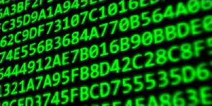

<style>
body {
text-align: justify}
</style>

# **Séquence 2**
# I. Les entiers positifs

## Cours


Le type de variables `int` pour "integer" de Python permet de manipuler des entiers. Ils sont ne sont en fait pas représentés comme nous en avons l'habitude : on utilise une autre **base**.

### A. La base 10 (décimale)
La base 10 est celle que nous utilisons naturellement aujourd'hui. Elle est constituée de 10 chiffres, de 0 à 9, et chacun des chiffres utilisé a une valeur différente en fonction de sa **position** (on parle de **numération de position**), nommée **rang** du chiffre. A chaque **rang** est associée une **puissance** de 10 différente.

***Exemples :*** 
- Prenons le nombre $2005_{10}$ (la notation $nombre_{10}$ indique que l'on considère sa représentation dans la base 10).

| Rang | Chiffre | 
| :---------------: |:---------------:|
| 3 |  2 |
| 2 |  0 |
| 1 |  0 |
| 0 |  5|

On peut décomposer ce nombre de la manière suivante : 

$2005_{10} =$

- Faire la même chose avec le nombre $1990_{10}$.

$1990_{10} =$

Qu'a-t-on fait pour décomposer ces nombres dans la base 10 ?  
<br>

### B. La base 2 (binaire)

> La **base binaire** est constituée de 2 nombres : 0 et 1 (un **bit**), et est très utilisée en informatique.

#### B.1. Du binaire au décimal
Pour passer d'un nombre écrit en binaire à sa représentation en base décimale, on multiplie chaque chiffre par la ***puissance de 2*** associée à son **rang** (comme pour la base décimale, mais avec 2 au lieu de 10).

*Les puissances de 2 usuelles sont à connaître et/ou à savoir retrouver :*

| Puissance de 2 | Valeur | 
| :---------------: |:---------------:|
| $2^0$ |  |
| $2^1$ |  |
| $2^2$ |  |
| $2^3$ |  |
| $2^4$ |  |
| $2^5$ |  |
| $2^6$ |  |
| $2^7$ |  |
| $2^8$ |  |
| $2^9$ |  |
| $2^10$ |  |


***Exemples :*** 
- $1010_2$.

| Rang | Chiffre | 
| :---------------: |:---------------:|
| 3 |  |
| 2 |  |
| 1 |  |
| 0 |  |

$1010_2 =$

- Faire la même chose avec le nombre $0110 0100_2$.

$0110 0100_2 =$

#### B.2. Du décimal au binaire

Pour passer d'un nombre en écriture décimale à sa représentation en binaire, on utilise l'*algorithme* suivant :
- On fait la division euclidienne ce nombre par 2 et on stocke le reste.
- On remplace ce nombre par le quotient de sa division euclidienne par 2.
- On s'arrête lorsque ce quotient devient 0.
- Le nombre en représentation binaire se lit en associant les restes des divisions successives, ***en commençant par la dernière***.

***Exemple :***
<br>
<br><br><br><br>

#### B.3. Nombre de bits nécessaires

Pour trouver le nombre de bits nécessaires pour représenter un nombre décimal, on cherche la **puissance de 2 supérieure la plus proche** à ce nombre. Le nombre de bits est donné par la puissance.

### C. La base 16 (hexadécimale)



La base 2 est à la base du fonctionnement de l'informatique, mais son utilisation peut être laborieuse lorsque l'on veut manipuler des nombres relativement grands. On utilise alors la **base 16**, ou **base hexadécimale**.

> La **base hexadécimale** est une base de 16 symboles, utilisant l'ensemble des chiffres de 0 à 9 pour coder ses 10 premiers éléments, et ensuite les lettres de A à F, représentant les nombres $10_{10}$ à $15_{10}$.

| Base 10 | Base 16 | 
| :---------------: |:---------------:|
| 10 |  |
| 11 |  |
| 12 |  |
| 13 |  |
| 14 |  |
| 15 |  |

#### C.1. De l'hexadécimal au décimal
Pour passer d'un nombre écrit en hexadécimal à sa représentation décimale, on multiplie chaque chiffre par la ***puissance de 16*** associée à son **rang**. Pour les lettres de A à F, on utilise le nombre correspondant dans la base 10 (voir le tableau ci-dessus).

***Exemples :***
- $5_{16} =$
- $2A_{16} =$
- $1BF_{16} =$

### C.2. Du décimal à l'hexadécimal

Pour passer d'un nombre en base 10 à sa représentation en base 16, on utilise le même algorithme que pour passer de la base 10 à la base 2, sauf que l'on divise successivement par 16.

***Exemple :***
<br><br><br><br>

### C.3. Hexadécimal et binaire

Cette base est facile d'utilisation de par sa relation avec la base binaire : il est facile de passer de l'une à l'autre. Pour représenter une valeur de 0 à 15, il faut 4 bits, donc pour représenter 1 octet on utilise 2 nombres en hexadécimal.

- Pour passer de l'**hexadécimal au binaire**, on associe la représentation binaire de chacun de ses symboles.  
$2A_{16} =$
- Pour passer du **binaire à l'hexadécimal**, on regroupe les bits par 4 (on ajoute des $0$ si nécessaire) et on convertit chaque groupe dans sa représentation hexadécimale.  
$10001110_{2} =$


***Exemple :*** Pour représenter la couleur des pixels d'une image, on utilise des valeurs allant de 0 à 255 pour chacune des composantes rouge, vert et bleu.
- Combien de bits faut-il pour représenter la valeur d'une composante ?  
<br>
- Pourquoi est-il intéressant d'utiliser la base hexadécimale ?  
<br>

### D. Une base quelconque

Les principes de conversion entre les bases décimale, binaire et hexadécimale sont les mêmes pour les autres bases (base 5, 7, 18, ou pourquoi pas 666...). Chaque nombre est décomposable dans n'importe quelle base comme la **somme des puissances de la base coefficientées**.

<br><br>

---

## TD : Représentation des entiers positifs


### Exercice 1 : représentation binaire des chiffres
Calculer la représentation binaire de l'ensemble des chiffres de $0_{10}$ à $9_{10}$.


### Exercice 2 : conversions binaire/décimal
1. Convertir en décimal :
    - $11_2$ 
    - $101_2$
    - $1010_2$
    - $100111_2$
2. Convertir en binaire, et *vérifier que le résultat est correct* :
    - $13_{10}$
    - $18_{10}$
    - $26_{10}$

### Exercice 3 : nombre de bits nécessaires à l'écriture d'un entier
- Calculer la représentation décimale de l'entier représenté en binaire par $1111$.

- Calculer la représentation décimale de l'entier représenté en binaire par $111111$.

- Quelle est la valeur maximale représentable sur 4 bits ? Sur 6 bits ? (les exprimer avec des puissances de 2) 

- Comment peut-on généraliser pour $n$ bits ?

- En déduire combien de nombres sont représentables sur $n$ bits.

- Je considère le nombre $35_{10}$. Comment savoir combien de bits est-ce qu'il faut utiliser pour le représenter en binaire ?


### Exercice 4 : addition d'entiers positifs (attention à l'*overflow* !)
Pour faire la somme de nombres binaires, on utilise les règles suivantes :

| Somme binaire |
| :---: | 
| $0_2+0_2 = 0_2$ |
| $0_2+1_2 = 1_2$ |
| $1_2 + 1_2 = 0_2$ et on retient $1$|

1. Faire la somme des entiers binaires $0100 1101_2$ et $11000110_2$, et vérifier votre résultat en utilisant la base décimale.

2. En machine, si on utilise uniquement 1 octet pour représenter chaque entier, que se passerait-il lorsqu'on ferait l'addition de la question précédente ?  

3. En pratique, il faut vérifier que l'on dispose de suffisamment de bits avant de faire l'addition de 2 entiers. Exprimer en fonction de $n$ le nombre maximal de bits nécessaires pour faire l'addition de deux entiers de taille $n$.  

### Exercice 5 : multiplication d'entiers positifs
Pour faire la multiplication de nombres binaires, on utilise les règles suivantes :

| Multiplication binaire |
| :---: | 
| $0_2*0_2 = 0_2$ |
| $0_2*1_2 = 0_2$ |
| $1_2 *1_2 = 1_2$ |

On procède de la même manière qu'avec le système décimal.  
Par exemple, $1100_2*1010_2=11000+1100000=1111000_2$

1. Poser la multiplication de $1010_2$ par $1110_2$.  
2. Sur combien de bits s'écrivent les résultats de ces deux exemples ?  
3. Généraliser en fonction de $n$, combien de bits sont nécessaire au maximum pour effectuer la multiplication de deux entiers positifs codés sur $n$ bits.  


### Exercice 6 : représentation hexadécimale 
Calculer la représentation hexadécimale de l'ensemble des nombres de $0_{10}$ à $20_{10}$.


### Exercice 7 : conversions hexadécimal/décimal
1. Convertir en décimal :
    - $3_{16}$
    - $1C_{16}$
    - $2D_{16}$
    - $B1_{16}$
    
2. Convertir en hexadécimal :
    - $18_{10}$
    - $75_{10}$
    - $926_{10}$

### Exercice 8 : conversions hexadécimal/binaire
1. Convertir en hexadécimal : 
    - $01000101_2$
    - $11010000_2$

2. Convertir en binaire :
    - $16_{16}$
    - $A5_{16}$

### Exercice 9 : adresses IP

1. Le format d'une adresse IPv4 est le suivant : a.b.c.d avec a, b, c et d des entiers allant de 0 à 255.
    - Combien de bits faut-il pour représenter chacun de ces entiers ?  
    - A combien d'octets cela correspond-il en tout ?  
    - Représenter l'adresse suivante en écriture binaire : 192.168.10.1  
    
2. Une adresse IPv6 est constituée de 8 champs de 4 valeurs hexadécimales, séparés par des ":". Par exemple, celle du serveur de facebook.com est : `2a03:2880:f145:82:face:b00c:0:25de`.
    - Combien de bits faut-il pour représenter chaque champ ?  
    - Combien de bits faut-il en tout pour écrire une adresse au format IPv6 ?  

<br><br>

---

## TP : Les entiers positifs en machine

### A. Les conversions en Python

#### A.1. Vers le décimal
1. Convertir $1001_2$ en décimal.
2. Vérifier votre solution en tapant dans la console Python :
```pycon
    >>> 0b1001
```
3. Convertir $5D_{16}$ en décimal.
4. Vérifier votre solution en tapant dans la console python :
```pycon
    >>> 0x5d
```

### A.2. Vers le binaire et l'hexadécimal
Les fonctions que vous allez utiliser sont des fonctions *natives* de Python, c'est-à-dire qu'il n'y a pas besoin d'importer de bibliothèques pour les utiliser.
1. Convertir $11_{10}$ en binaire.
2. Vérifier votre solution en tapant dans la console python :
```pycon
    >>> bin(11)
```
3. Quel est le format de la sortie de cette fonction ?
4. Il est possible de la convertir en `int` avec la fonction `int()` dont  un extrait de la documentation est donné ci-dessous. Utiliser cette documentation pour convertir la sortie de la fonction `bin()` en `int`.
```
int(x, base=10) -> integer
Convert a number or string to an integer (...) If x is not a number or if base is given, then x must be a string, bytes, or bytearray instance (...)
```

5. Convertir $195_{10}$ en hexadécimal.
6. Vérifier votre solution en tapant dans la console python :
```pycon
    >>> hex(195)
```


### B. Le type `int`

Dans certains langages informatiques, comme le C, il existe plusieurs types différents d'entiers en fonction du nombre de bits nécessaire pour représenter le nombre.

En Python, il n'y a qu'un seul type. On peut donc penser que la taille des entiers qui peuvent être manipulés est infinie... mais l'infini n'existe pas en informatique. Si la *taille maximale* (souvent 32 ou 64 bits) utilisable par le processeur est dépassée, le nombre est découpé en plusieurs parties. Cela a pour conséquence un espace plus grand occupé en mémoire et un ralentissement de l'exécution du programme. 

La bibliothèque *time* de Python permet de mesurer ce temps d'exécution. Dans le code suivant, on importe pour cela la fonction `time` :

```python
from time import time

st = time()
for i in range(50000):
    a = 2**i
    
print(time()-st)
```

| `range` | `0` à `49 999` | `50 000` à `99 999` | `200 000` à `249 999` |
| :---------------: |:---------------:| :---------------:| :---------------:|
| temps d'exécution |  |

1. Exécuter ce programme et reporter dans le tableau la valeur qui s'affiche à l'écran.
2. Changer les bornes du `range` pour avoir i variant de `50 000` à `99 999`. Reporter la valeur obtenue.
3. Faire de même pour faire varier i entre `200 000` et `249 999` et reporter le résultat.
4. Qu'en concluez-vous ?