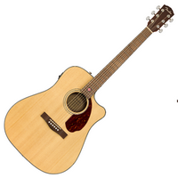

<style>
body {
text-align: justify}
</style>

# **Séquence 1**
# II. Le paradigme orienté objet
---

## TP : Un combat de monstres

> Dans ce TP, vous utiliserez un seul fichier Python que vous modifierez au fur et à mesure. Enregistrez-le au début du TP.


Dans l'univers de la série du ***Sorceleur*** de l'écrivain Andrzej Sapkowski, différents types de personnages s'affrontent. Certains ont des caractéristiques particulières comme les sorceleurs qui sont très habiles au combat et maîtrisent une certaine forme de magie. Il sont chargés d'éliminer les monstres présents sur le continent.

Pour représenter une situation de manière réaliste, le **paradigme dit "objet"** est le plus approprié. Il permet de modéliser des éléments du monde réel ou bien des concepts. Ce paradigme utilise des classes, une classe pouvant définir aussi bien un animal, qu'un véhicule, un humain, un steak, un schtroumpf... Les éléments de ces classes sont des **objets**, que nous allons utiliser pour représenter des sorceleurs et des monstres.

1. Implémenter le code suivant :
```python
class Personnage:        # définition de la classe
    pass                # pour l'instant, elle ne fait rien

geralt = Personnage()    # création d'un élément de la classe : un objet
monstre = Personnage()   # création d'un deuxième objet
```
Tous les objets de la classe `Sorceleur` auront les mêmes *caractéristiques* : des variables nommées **attributs**, et les mêmes *comportements* définis par des fonctions appelées **méthodes**. Parmi les caractéristiques des sorceleurs, on peut avoir leur nombre de points de vie.  

2. Implémenter le code suivant :
```python
class Personnage:
    def __init__(self): # cette fonction est une méthode de la classe Sorceleur nommée "constructeur" : utilisée pour "construire" chaque nouvel objet
        self.vie = 50   # on attribue 50 points de vie par défaut à tout nouveau sorceleur

geralt = Personnage()
monstre = Personnage()
```
Taper dans la console : `geralt.vie` et `monstre.vie` et vérifier que la valeur attribuée à l'attribue `vie` est correcte.

3. On peut vouloir définir au moment de la création de chaque objet une valeur initiale de points de vie différente pour chacun. Modifions le programme :
```python
class Personnage:
    def __init__(self, v):  # la valeur est donnée en paramètre du constructeur
        self.vie = v 

geralt = Personnage()
monstre = Personnage()
```
Vérifier que le nombre de points de vie de chacun est correct.
> Un constructeur peut avoir plusieurs arguments, mais il a toujours au moins l'argument `self` qui fait référence à l'objet lui-même. `self` est nécessaire pour accéder aux **attributs** et aux **méthodes** ***à l'intérieur*** de la classe. Il n'existe plus à l'extérieur.

4. Ajoutons quelques méthodes à notre classe pour mieux simuler le comportement des personnages :
```python
class Personnage:
    def __init__(self, v): 
        self.vie = v

    def perd_vie(self):
        self.vie = self.vie - 1

    def donne_etat(self): 
        return self.vie
    
geralt = Personnage(50)
geralt.perd_vie()
pts = geralt.donne_etat()
```
Que vaut la variable `pts` ?

5. Modifier la méthode `perd_vie` pour que le nombre de points perdus soit défini aléatoirement à l'aide de la fonction `randint` de la bibliothèque du `random` : elle retournera un entier entre 1 et 10 qui correspondra au nombre de points perdus.
```python
from random import randint       # instruction pour importer la fonction
```
```pycon
help(randint)       "commande pour extraire la documentation de la fonction"
```

6. Ajouter un attribut `exp` représentant l'expérience du personnage. Créer les méthodes `gagne_exp` et `donne_exp` permettant, respectivement, de faire gagner une valeur `e` d'expérience, et de consulter la valeur de l'attribut `exp`.

7. Créer un programme principal dans lequel `geralt` affronte `monstre` selon les règles suivantes :
- Chacun attaque l'autre à tour de rôle jusqu'à ce que le nombre de points de vie d'un des personnages descende à 0 (ou moins),
- Si l'*expérience* d'un personnage est supérieure à 40, alors son adversaire perd entre 5 et 10 points à chaque attaque. Sinon, il perd entre 0 et 5 points.
- Le vainqueur il gagne 2 points d'expérience. Il peut ensuite combattre un autre adversaire.

    ***Attention !*** Pour accéder aux valeurs des attributs, il faut utiliser les méthodes `donne_etat` et `donne_exp`.

***Pour aller plus loin...***  
*Vous pouvez étendre les possibilités du jeu, par exemple en organisant une sorte de tournoi avec plusieurs sorceleurs et plusieurs monstres. Il est aussi possible d'exploiter les différences entre monstres et sorceleurs en créant deux classes différentes, ayant des méthodes spécifiques traduisant les pouvoirs de chacun.*

<br>

---

## Cours

### A. Syntaxe de la programmation orientée objet (POO)
- Dans le code ci-dessous, entourer la partie correspondant à la **définition** de la classe `Exemple` d'une couleur, et la partie correspondant à son **utilisation** d'une autre couleur.

```python
class Exemple:

    def __init__(self, param1, param2):
        self.attribut1 = param1
        self.attribut2 = param2

    def methode(self, param):
        #traitement sur le paramètre

    def accesseur_att1(self):
        return self.attribut1

    def mutateur_att1(self, val):
        self.attribut1 = val

e = Exemple()  #création d'un objet
a1 = e.accesseur_att1()
e.mutateur_att1(5)  #en supposant que attribut1 est de type int
```
- Compléter les définitions suivantes :
> Une **classe** regroupe un ensemble de propriétés (ses **attributs**) et de comportements (ses **méthodes**) communes à différents objets.

> Un **objet** est un élément, une instance d'une classe.

> Un **attribut** d'un objet est une caractéristique, une propriété commune à tous les objets de la classe.

> Une **méthode** est une fonction d'une classe, traduisant le comportement de ses objets. Elle ne peut s'appliquer que sur les objets de la classe. Le **constructeur** de la classe (`__init__`) est une méthode particulière, appelée à la création de chaque nouvel objet. Il initialise ses attributs. Les autres méthodes manipulent les attributs : elles peuvent chercher à y accéder (*accesseurs* ou *"getters*") ou à les modifier (*mutateurs* ou *"setters"*).

<div style="page-break-after: always; visibility: hidden"> 
\pagebreak 
</div>

### B. Exemple


```python
class Guitare:

    def __init__(self, t, m):
        self.type = t
        self.marque = m
        self.notes = [0,0,0,0,0,0]  #représente les 6 cordes, et le fret sélectionné pour jouer un accord par un int

    def joue(self,n):
        self.notes = n

    def ecoute_son(self):
        return self.notes

gfolk = Guitare("folk", "Fender")
gelec = Guitare("électrique", "Gibson")
gelec.joue([0,3,2,0,1,0])   #accord de do
s = gelec.ecoute_son()
```





<br>

---

## Exercices

### Exercice 1 : *(sur feuille, à tester sur ordinateur)*


```python
class Chat:
    def __init__(self):
        self.faim = 0
        self.fatigue = 0

    def bonjour(self):
        print("Miaou !")

    def joue(self):
        self.faim = self.faim+1
        self.fatigue = self.fatigue+1

class Chien:
    def __init__(self):
        self.faim = 0
        self.fatigue = 0

    def bonjour(self):
        print("Ouaf !")

    def joue(self):
        self.faim = self.faim+1
        self.fatigue = self.fatigue+1
```

1. Quel est l'intérêt ici d'avoir défini deux classes différentes pour les chiens et pour les chats ?

2. Créer un objet de la classe `Chat`, un objet de la classe `Chien`, et les faire se dire bonjour.

3. La fonction `isinstance(objet, classe)` de Python teste si `objet` appartient à `classe`. On veut modifier les deux méthodes `bonjour` pour leur donner en paramètre l'animal auquel est dit bonjour et faire que :
    - un chat dise bonjour à un autre chat, mais ignore un chien,
    - un chien dise bonjour à un autre chien, et essaye de faire peur à un chat en aboyant plus fort : "OUAF !".  
Tester les méthodes obtenues.

3. Proposer une autre implémentation utilisant une seule classe `Animal`, sans perdre l'information que l'on peut avoir des chats ou bien des chiens. Reprendre la version initiale de se saluer des animaux. La tester en créant des instances de la classe.

4. Ecrire une méthode `mange` et une méthode `repos` dans la classe `Animal` décrémentant respectivement l'attribut `faim` de 1, et l'attribut `fatigue` de 2.


### Exercice 2 : *(sur feuille, à tester sur ordinateur)*

```python
from math import sqrt

class Astre:
    '''Corps célestes, définis par leurs propriétés physiques.'''

    def __init__(self, m, p):
        self.masse = m
        self.position = p

    def distance(self, astre):
        return ...
```

1. L'attribut `position` est une liste Python contenant deux éléments : sa coordonnée en x et sa coordonnée en y *(on se situe dans le plan, pas en 3D)*.  
Pour calculer la distance entre deux astres de position, respectivement, (x1, y1) et (x2, y2), on utilise la formule mathématique suivante : $d = \sqrt{ (x_{1}-x_{2})^2 + (y_{1}-y_{2})^2 }$  
Compléter la définition de la méthode `distance`.

2. Un astre peut peser entre 0.07 et 300 fois la masse solaire, elle-même de $2*10^{30}$.
Créer deux objets de la classe `Astre`, de masse minimale et maximale et respectivement de position [15,34] et [6,27].

3. Calculer la distance entre ces deux objets.


### Exercice 3 : les attributs privés *(sur ordinateur)*

Les valeurs des attributs des objets Python sont par défaut modifiables après la création de l'objet. Il est possible d'interdire la modification des attributs en le déclarant avec deux tirets bas avant son nom : `__x` par exemple. Ils sont alors privés : on ne peut pas les manipuler en dehors de la définition de la classe. C'est une **bonne pratique** d'utiliser des attributs privés, et c'est ce qui rend les **accesseurs** et **mutateurs** nécessaires.

On rend privés les attributs de la classe `Chat` de l'exercice 1:

```python
class Chat:
    def __init__(self):
        self.__faim = 0
        self.__fatigue = 0
```
1. Créer un objet de la classe. Que se passe-t-il si on tente d'accéder à ses attributs ?

2. Créer les accesseurs et mutateurs nécessaire pour récupérer la valeur des deux attributs et pouvoir la modifier. Les tester sur un exemple d'objet.


### Exercice 4 : les classes de Python *(sur ordinateur)*
Les types Python sont implémentés par des classes.

1. Afficher la valeur de l'attribut ```__class__``` des expressions suivantes : `()`, `[]`, `{}`, `int(0)`.

2. En déduire comment utiliser la fonction `isinstance` de l'exercice 3 pour tester si une valeur est un entier, une liste, un tuple, ou bien un dictionnaire.

3. Utiliser cette fonction pour écrire une fonction `separe` qui prend en argument une liste Python et sépare les chaînes de caractères des entiers qu'elle contient *(c'est une mauvaise pratique de mélanger les deux !)*.

**Exemple :**
```python
entiers, caracteres = separe([1, "a", 666, "blablabla", "nsi"])
```
```pycon
>>> entiers
[1,666]
>>> caracteres
["a", "blablabla", "nsi"]
```

### Exercice 5 : paradigmes objet et impératif *(sur feuille, à tester sur ordinateur)*


Reprendre l'exemple de l'exercice 2. L'objectif est de traduire ce code utilisant le paradigme objet en un code purement impératif. 

Pour cela :  
- On utilise un dictionnaire pour stocker les valeurs des attributs d'un objet *(c'est comme ça que fait Python en réalité !)*.  
- On rédéfinit les méthodes comme de simples fonctions.

Utiliser les mêmes exemples que dans l'exercice 2.


<br>

---

## Problème : Gestion d'adresses IP

On rappelle qu'une adresse IPv4 est une adresse de 4 octets, notée en décimale à point, en séparant chacun des octets par un point. On considère le réseau privé 192.168.1.0.


1. A quoi sert l'adresse IP attribuée à une machine ?

1. Ecrire cette adresse en binaire, en faisant apparaître tous les bits utilisés.

2. 192.168.1.0 est une adresse réservée, la "première" du réseau. On considère qu'on ne peut pas modifier les trois premiers octets pour trouver une adresse à attribuer à une machine. On ne peut pas non plus utiliser la "dernière" adresse : celle correspondant au nombre le plus élevé écrit sur le dernier octet. Quelle est cette "dernière" adresse ?

3. En déduire le nombre d'adresses de ce réseau qui peuvent être attribuées à des machines.

4. Donner une adresse de ce réseau utilisable en écriture décimale, et en binaire.

Pour parcourir les adresses utilisables, on définit une classe `AdresseIP` :
```python
class AdresseIP:

    def __init__(self, adresse):
        self.adresse = ...

    def liste_octets(self):
        """ Renvoie une liste Python de nombres entiers, la liste des octets de l'adresse IP """
        return [int(i) for i in self.adresse.split(".")]

    def est_reservee(self):
        """ Renvoie True si l'adresse IP est une adresse réservée, False sinon """
        return ... or ...

    def adresse_suivante(self):
        """ Renvoie un objet de AdresseIP avec l'adresse IP qui soit celle du self si elle existe, None sinon """
        if ... < 254:
            nouvel_octet = ...
            return AdresseIP('192.168.1.' + ...)
        else:
            return None
```
5. Compléter le constructeur de cette classe.

6. Compléter la méthode `est_reservee`, permettant d'exclure les adresses identifiées dans la question 2.

7. Compléter la méthode `adresse_suivante`, en utilisant `liste_octets`.

8. Créer les objets de la classe ayant pour attribut : `192.168.1.1`, `192.168.1.0` et `192.168.1.254`.

9. Tester les méthodes `est_reservee` et `adresse_suivante` sur ces objets pour vérifier leur bon fonctionnement.