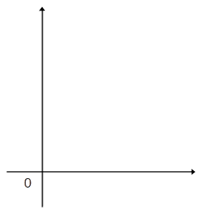
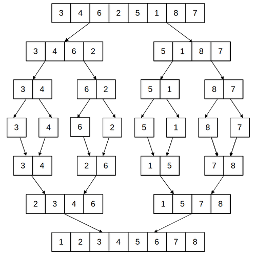
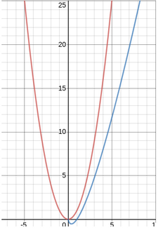
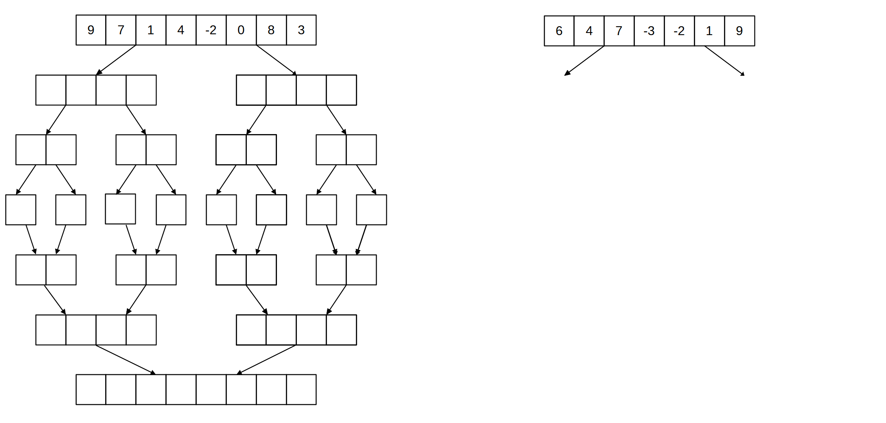

<style>
body {
text-align: justify}
</style>

# **Séquence 2**
# III. Diviser pour régner
---

## Cours
### A. Notions d'algorithmique

- Qu'est-ce qu'un **algorithme** ?  
***Un algorithme est une suite d'instructions permettant de résoudre un problème.***  

- Qu'est-ce que la **complexité** d'un algorithme ?  
***La complexité d'un algorithme évalue la quantité de ressources (en temps, en mémoire), nécessaire à son exécution.***

- A quoi sert l'évaluation de cette complexité ?  
***Evaluer la complexité d'un algorithme sert à le comparer à d'autres algorithmes résolvant le même problème.***

- Dans le programme de NSI, on s'intéresse à la complexité **en temps dans le pire des cas**. Qu'évalue-t-on alors ?  
***On estime le nombre d'opérations élémentaires exécutées, en fonction de la taille des données d'entrée notée n.***

Tracer les différent types de complexités que vous connaissez sur un graphique. En donner des exemples types d'algorithmes associés.



***- constant : retour d'une valeur (la moitié d'un nombre, test,...)***  
***- linéaire : parcours d'un tableau, 1 boucle***  
***- quadratique : parcours d'un tableau à deux dimensions, 2 boucles imbriquées***


### B. Les algorithmes du type "diviser pour régner"

**"Diviser pour régner"** est une *méthode algorithmique* : une manière de résoudre des problèmes algorithmiquement.

Son principe est, lorsque l'on considère un problème, de le découper en plusieurs sous-problèmes équivalents, mais de taille plus réduite. Ces "petits problèmes" seront plus simples à résoudre que le problème initial. Une fois les "petits problèmes" résolus, il faut les recombiner pour obtenir une solution au problème initial.  

Les trois principes à la base de cette méthode de "diviser pour régner" sont :  
- **Diviser :** ***on divise le problème initial en sous-problèmes***  
- **Régner :** ***on résoud les sous-problèmes***  
- **Combiner :** ***on combine les solutions des sous-problèmes, pour avoir la solution du problème initial***

Le principe de la récursivité étant similaire à celui de cette approche, on utilise souvent des **algorithmes récursifs**. Cela n'est pas obligatoire ! Une approche "diviser pour régner" peut aussi être **itérative** (avec des boucles).


### c. Le tri fusion

#### C.1. Principe et exemple

Le **tri fusion** est une manière de trier une liste en la divisant successivement, puis en fusionnant petit à petit les sous-listes triées pour finalement en obtenir une seule : la liste initiale triée.

Les trois étapes de cet algorithme sont :  
- **Diviser :** ***on divise le tableau successivement en deux, jusqu'à obtenir des tableaux de taille 1.***  
- **Régner :** ***on obtient un tableau de taille 1 qui est trié. A chaque nouvelle fusion, on s'assure que le résultat est trié.***  
- **Combiner :** ***on fusionne les tableaux triés deux à deux, jusqu'à en obtenir une seule.***




#### C.2. Comparaison avec les autres algorithmes de tri

Rappeler les principe des deux algorithmes de tri du programme de 1ère :

|  Tri par sélection  |  Tri par insertion  |
| :----: | :----: |
| ***On sélectionne le minimum du tableau, et on l'échange avec l'élément en première position.***  | ***On prend le 2ème élément, on le compare avec le premier, et on échange les deux s'ils ne sont pas rangés dans l'ordre croissant.***  |
| ***On sélectionne le minimum de l'ensemble des éléments du tableau sauf le premier, et on l'échange avec celui en 2ème position.*** | ***On prend le 3ème élément, on le compare avec les précédents jusqu'à trouver un élément plus petit que lui. On l'échange avec le dernier élément plus grand.*** |
| ***On répète ces opérations, en réduisant de un en un la partie du tableau considérée, jusqu'à l'avant-dernier élément.*** | ***On répète ces opérations en parcourant de un en un les éléments du tableau, jusqu'au dernier.***|


- Quel est le type de complexité de ces deux algorithmes ?  
***Ces algorithmes ont une complexité quadratique (en $n^2$).***

- La complexité du **tri fusion** est en $nlog(n)$. Est-il donc judicieux de l'utiliser à la place d'un tri par sélection ou par insertion ?   
***Il est pertinent d'utiliser le tri fusion, car sa complexité est meilleure : la courbe la représentant se trouve en-dessous de la courbe de la fonction quadratique, pour une valeur de n donnée.***


<br><br>

---

## TP : Le tri fusion

### A. Application
Appliquer l'algorithme du tri fusion sur l'exemple ci-contre, en complétant le schéma avec les divisions et recombinaisons successives.


Dans le cas d'un tableau ayant un nombre impair d'éléments, on peut considérer que le tableau le plus petit va se retrouver à gauche, le plus grand à droite.




### B. Implémentation
L'implémentation du tri fusion se fait classiquement avec deux fonctions :  
- une **fonction principale** qui **divise** le tableau passé en paramètre par deux,  
- une **fonction** qui fait la **fusion** entre deux tableaux triés.

#### B.1. La fusion  
Elle peut être écrite de manière *récursive* ou bien *itérative*. Tester les deux versions sur les listes `[1,4,7,9]` et `[-2,0,3,8]`.

***Version itérative :***  
Compléter le code suivant :

```python
def fusion_it(T1, T2):
    taille_1 = len(T1)
    taille_2 = len(T2)
    T_trie = []
    i1 = 0
    i2 = 0
    while (i1 < taille_1) and (...):
        if T1[i1] < T2[i2]:
            T_trie.append(...[i1])
            i1 = ...
        else:
            T_trie.append(T2[...])
            i2 = ...
    while i1 < taille_1:
        T_trie.append(...)
        i1 = ...
    while i2 < taille_2:
        T_trie.append(...)
        ...
    return T_trie
```

***Version récursive :***  
On donne le squelette de la fonction, à compléter :
```python
def fusion_rec(T1,T2):
    if ............  # premier cas de base, pour une valeur triviale de T1
        return T2
    elif ...........  # deuxième cas de base, pour une valeur triviale de T2
        return T1
    elif T1[0] < T2[0]:
        return [.....] + fusion(........, .........)    # on place le bon élément en premier
    else:
        return [.....] + fusion(........, .........)
```

#### B.2. Le tri complet  
La fonction permettant de trier complètement le tableau divise d'abord en deux le tableau initial, avant de fusionner les résultats des tris sur la première, et la deuxième partie du tableau.

Compléter le code suivant :
```python
def tri_fusion(tab):

    if ....................     # cas de base
        return tab
    else:
        # on coupe le tableau en deux sous-tableaux
        t1 = [tab[i] for i in range(.......)]
        t2 = [tab[i] for i in range(.......)]

    return fusion(tri_fusion(.....), tri_fusion(.....))
```
Pour prendre les deux moitiés du tableau, on aurait pu faire du *slicing*. Cette méthode a aussi des désavantages, il est utile de connaître plusieurs méthodes pour sélectionner une partie d'un tableau.


<br><br>

---

## TP : La recherche dichotomique


La recherche dichotomique d'un élément `e` dans un tableau trié consiste :  
1. A comparer `e` avec celui au milieu du tableau :  
    - si `e` est plus grand, on continue la recherche dans la partie droite du tableau.  
    - sinon, on continue la recherche dans la partie gauche du tableau.  
2. On recommence en comparant `e` avec le milieu de la partie du tableau considérée, et ainsi de suite.  
3. L'algorithme termine lorsque `e` est trouvé, ou bien si l'on arrive sur le tableau vide.

1. Appliquer l'algorithme pour rechercher `10` dans `[1,6,10,15,17,20]`. Rechercher `5` dans ce même tableau.

2. Compléter la version récursive suivante :
```python
def recherche_dichotomique_rec(t, elt, inf, sup):
    """Version récursive de la recherche dichotomique d'un élément dans un tableau trié'
    
    Entrées :
        t : liste Python (tableau) d'entiers ou de flottants triée
        elt : entier ou flottant recherché
        inf, sup : entiers correspondant respectivement à l'indice inférieur et supérieur de la partie de t considérée

    Sortie :
        entier, valant -1 si l'élement n'est pas trouvé, l'indice de l'élément trouvé dans le tableau sinon
    """
    
    mil = (sup+inf)//2
    if sup<inf:
        return ...
    elif ...
        return mil
    elif elt > t[mil]:
        return recherche_dichotomique_rec(t, elt, ..., ...)
    else:
        return recherche_dichotomique_rec(t, elt, ..., ...)
```

3. Écrire une fonction `recherche` itérative qui prend en paramètres un tableau `tab` de nombres entiers triés par ordre croissant et un nombre entier `n`, et qui effectue une recherche dichotomique du nombre entier `n` dans le tableau non vide `tab`. Cette fonction doit renvoyer un indice correspondant au nombre cherché s’il est dans le tableau, -1 sinon. 

> **N.B. :** *Cette version, du programme de 1ère, utilise une boucle ***while*** à la place de l'appel récursif de la version précédente.*
