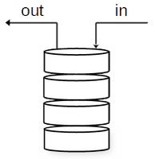
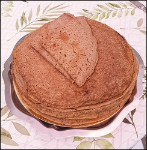
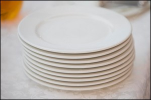

<style>
body {
text-align: justify}
</style>

# **Séquence 2**
# I. Les piles
---

## Cours

### A. Définitions

Qu'est-ce qu'une **pile** en informatique ?



 Une **pile** est une structure de données, c'est-à-dire une manière de stocker, d'accéder et de manipuler des données. Elle fonctionne sur le principe du "dernier entré, premier sorti", en anglais "last in, first out" (LIFO).



**Exemples de la vie quotidienne :** les piles d'assiettes, de crêpes, de livres, etc.

**Exemples en informatique :** 
- la fonction "Défaire" ou "Undo" d'un logiciel de bureautique,  
- la mémorisation des pages visitées dans un navigateur web.  

<br><br><br>

Pour utiliser une telle structure dans un programme, il faut implémenter des fonctions de base qui correspondent à ce fonctionnement. On veut pouvoir :  
- ***construire*** une nouvelle pile (vide),  
- ***ajouter*** un élément à la pile : on ***empile*** un élément, qui se retrouve *au-dessus* des autres,  
- ***enlever*** un élément à la pile : on ***dépile*** un élément, le *dernier* ajouté,  
- ***tester*** si la pile est ***vide*** ou non.


### B. Implémentation

On propose une implémentation de pile, utilisant la POO *(ce qui n'était pas obligatoire !)*.

```python
class Pile:
    """ Définition d'une pile avec une liste Python """

    def __init__(self):
        """Initialise une pile vide"""
        self.L = []

    def vide(self):
        """Teste si la pile est vide"""
        return self.L == []

    def depiler(self):
        """dépile, c'est-à-dire enlève le dernier élément de la pile"""
        assert(not(self.vide()))   # précondition
        return self.L.pop()

    def empiler(self, x):
        """Empile, c'est-à-dire ajoute un élément à la fin de la pile"""
        self.L.append(x)                         
```
- Ajouter la description des différentes méthodes *(à associer aux fonctions de base décrite ci-dessus)*.
- Ajouter une assertion qui vérifiera une précondition sur les données d'entrée nécessaire au bon fonctionnement de `depiler`.
- Créer un objet de la classe `Pile` et lui ajouter successivement les entiers 0, 1 et 2.
```python
p = Pile()
p.empiler(0)
p.empiler(1)
p.empiler(2)
```
- Enlever le dernier élément de la pile. Avant de le faire, il faudra vérifier qu'elle n'est pas vide.

```python
if not(p.vide()):
    p.depiler()
```

<br>

--- 

## Exercices

### Exercice 1 : sur un logiciel de traitement de texte *(sur feuille)*

Un utilisateur de traitement de texte tape successivement les lettres suivantes : ‘v’, ‘i’, ‘v’, ‘e’, ‘n’ (étape 1). Il s’arrête et clique une fois sur « undo » (étape 2). Il continue : ‘ ’ (espace), ‘l’, ‘e’, ‘s’, ‘ ‘, ‘m’, ‘a’, ‘t’, ‘h’, ‘s’ (étape 3). Pris d’un doute, il change d’avis et clique 9 fois sur « undo » (étape 4). Il rectifie en tapant : ‘n’, ‘s’, ‘i’ (étape 5).

Dessiner les étapes 1 à 5 décrites ci-dessus en représentant le contenu de la pile stockant les caractères au fur et à mesure.

<br><br><br><br><br><br><br>

### Exercice 2 : des crêpes trop goûtues *(sur feuille d'abord)*

Erwan invite des amis à manger des crêpes. Il les place les unes sur les autres sur une assiette. Il commence à en manger une pour goûter le résultat, et la trouve tellement bonne qu’il ne peut s’empêcher de manger les autres… jusqu’à la dernière.

En utilisant la classe `Pile` du cours, écrire une fonction `vide_crepes` qui prend en paramètre une pile de crêpes (`pile_crepes`) et la vide complètement. Cette fonction ne renvoie rien, mais l’instruction `pile_crepe.vide()` doit retourner `True` après son exécution.

```python


```
Comment cela se fait-il que l'on puisse modifier une variable dans une fonction, et récupérer cette valeur modifiée à l'extérieur ?  
*C'est une particularité de Python, cela fonctionne pour les listes Python (et autres types composés), mais pas pour des variables de type `int`, `str`, `bool`.*


### Exercice 3 : les assiettes de la grand-mère *(sur feuille d'abord)*



Marion est à la recherche des assiettes qui lui viennent de sa grand-mère, qui sont rangées en bas d’une pile d’autres assiettes. Il faut qu’elle dépile cette dernière, jusqu’à trouver la première assiette de sa grand-mère. Elle se retrouve finalement avec deux piles d’assiettes.

En utilisant la classe `Pile` du cours, écrire une fonction `separe_assiettes(pile_assiettes, elt)` qui dépile `pile_assiettes` jusqu’à rencontrer l’assiette `elt` et empile les assiettes retirées dans une autre pile. La fonction retourne `pile_assiettes` modifiée, et la 2ème pile. Si les assiettes recherchées ne sont pas trouvées, la fonction ne retourne rien.

```python


```

### Exercice 4 : expressions bien parenthésées *(sur ordinateur)*
Nous voulons écrire une fonction qui contrôle si une expression mathématique, donnée sous forme d’une chaîne de caractères, est bien parenthésée : c’est- à-dire s’il y a autant de parenthèses ouvrantes que de fermantes, et qu’elles sont bien placées.

**Exemple :**  
(..(..)..) est bien parenthésée.  
(...(..(..)...) ne l’est pas.

Voici l’algorithme utilisé :
```python
Notre expression est stockée dans une variable 'exp'
La sortie est stockée dans une variable 'parenthesee'
On crée une pile 'p'
Pour i variant de 0 à la longueur de exp-1
    Si élément 'i' de 'exp' vaut "("
        On empile "(" dans 'p'
    Sinon si élément 'i' de exp vaut ")"
        si 'p' non vide
            on dépile 'p'
        sinon
            'parenthesee' vaut "Faux"
'parenthesee' vaut : 'p' est-elle vide ?
```
1. Traduire ce pseudo-code en code Python. Utiliser la structure de pile du cours.

2. Tester le code sur les expressions suivantes :
    - $((2+64)*2^8+5)$
    - $10+((75-64)*4$

***Pour aller plus loin...*** Faire en sorte que le programme tienne également compte des "[" en plus des "(".