<style>
body {
text-align: justify}
</style>

# **Séquence 2**
# II. La récursivité
---

## Cours
### Introduction


Les *poupées russes* ou *matriochkas* sont des séries de poupées de tailles décroissantes placées les unes à l'intérieur des autres. Elles sont toutes identiques, ne différant que par leur taille. La dernière est différente, dans le sens où elle ne contient pas d'autre poupée à l'intérieur.  

Une matriochka est une **structure récursive** : c'est une matriochka pleine, OU bien une matriochka contenant une autre matriochka plus petite.


### A. Définition

 Une **fonction récursive** est une fonction qui s’appelle elle-même.

Pour éviter que cette fonction s’appelle à l’infini, il faut :  
- ***qu’elle ait un cas de base (c'est le cas le plus simple à résoudre), aussi appelé condition d'arrêt (dans laquelle il n'y a plus d'appel récursif donc la fonction s'arrête),***  
- ***qu’elle se ramène vers ce cas de base, donc qu'il y ait un appel à elle-même sur un plus petit problème que le problème initial (un entier plus petit, une chaîne de caractère plus courte, etc).***  
      

### B. Fonctionnement d'une pile d'exécution

#### B.1. Cas général
Lors de l’appel d’une fonction, le système sauvegarde différents paramètres comme ses arguments et les variables utilisées à l’intérieur de celle-ci. C’est son **contexte d’exécution**. Cela permet d’interrompre l’exécution d’une fonction lorsque celle-ci en appelle d’autre, et de reprendre son exécution ensuite.

**Exemple :**

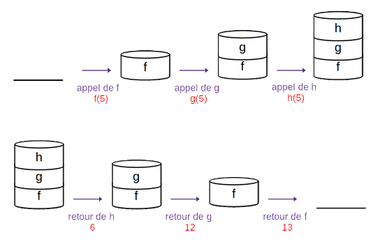

```python
def h(x):
    return x + 1

def g(x):
    return h(x) * 2

def f(x):
    return g(x) + 1
```

#### B.2. Cas récursif

Une fonction récursive est une fonction dans laquelle il y a des appels de fonctions, avec la particularité qu'il s'agit de la même fonction. La même chose se produit donc : une **pile d’exécution** est utilisée pour stocker le contexte d’exécution de ses différents appels.

Prenons l'exemple classique du calcul de $2^n$ :
```python
def puissance(n) :
    if n == 0 :
        return 1
    else :
        return 2*puissance(n-1)
```

Ecrire le calcul de `puissance(3)` :  
***puissance(3) = 2 * puissance(2)  
		puissance(2) = 2 * puissance(1)  
				puissance(1) = 2 * puissance(0)  
						puissance(0) = 1  
puissance(3) = 2 * 2 * 2 * 1 = 8***


Le schéma suivant explique le processus en terme de pile d’exécution :
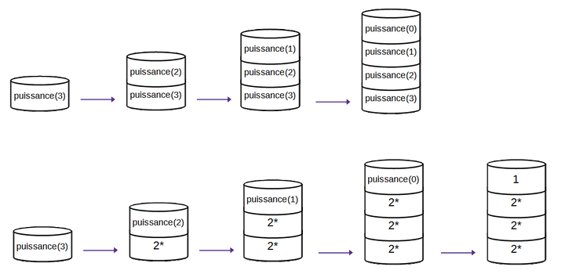

#### B.3. Cas limite

La pile d’exécution a une taille maximale. Lorsque la pile déborde - "stack overflow" - (par défaut au bout de 1000 appels), Python renvoie le message suivant :
```python
RecursionError: maximum recursion depth exceeded while calling a Python object
```


### C. Récursivité et paradigmes

Le paradigme **récursif** s’oppose généralement au paradigme **itératif**. Ce dernier est une sous-catégorie du **paradigme impératif** et fait référence à l’utilisation de boucles.

Avec la récursivité, on peut se passer de boucles. C’est cette méthode de programmation qui les remplace lorsque l’on programme en utilisant le **paradigme fonctionnel**.

<br>

---

## Exercices

Les exercices traitent d'abord d'algorithmes qui manipulent des *entiers*, puis des *chaînes de caractères* (et des *listes* en bonus).

### Exercice 1 : factorielle
La fonction factorielle, appliquée à un entier $n$ est notée $!n$ et est définie de la manière suivante :  
- $!0 = 1$  
- $!n = 1*2*...*(n-1)*n$  

1. Exprimer $!n$ en fonction de $!(n-1)$.
2. En déduire une fonction `factorielle(n)` calculant la valeur de `!n` pour tout entier `n`.
3. Vérifier que `factorielle(5)` renvoie bien la valeur `120` et `factorielle(7)` la valeur `5040`.
4. Dessiner la pile d'exécution pour l'appel de `factorielle(4)`.
5. Vérifier votre travail en visualisant l'exécution de votre code avec https://pythontutor.com/visualize.html


### Exercice 2 : la suite de Fibonacci

La suite de Fibonacci est définie comme suit :  
- $u_0 = 0$ et $u_1 = 1$  
- $u_n=u_{n-1}+u_{n-2}$  
1. Écrire une fonction récursive `fib_rec(n)` qui donne le `n`ième terme de la suite de Fibonacci.
2. Représenter les appels récursifs de `fib_rec(5)` sous la forme d’une structure hiérarchique, puis sous la forme d’une pile.

### Exercice 3 : palindromes

Un palindrome est un mot pouvant se lire à l'endroit comme à l'envers, comme "été" ou "radar".

On veut écrire une fonction `palindrome` prenant en entrée une chaîne de caractère `mot` et renvoyant un booléen indiquant si ce mot est un palindrome ou non.

1. Les cas de base sont les cas où `mot` est de longueur 0 ou 1. Que doit renvoyer la fonction dans ces cas ?
2. Dans tous les autres cas, `mot` est un palindrome si :
    - la première et la dernière lettre du mot sont identiques,
    - le reste du mot (sans la première et la dernière lettre) est un palindrome.
    Sur quelle valeur l'appel récursif se fait-il ?
3. Ecrire la fonction `palindrome` incluant ces différents cas.
<br><br>

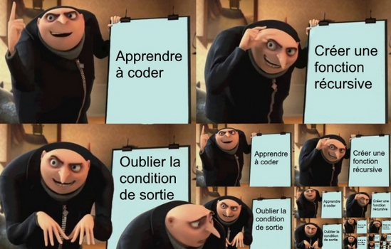

---
### Pour aller plus loin...
### Exercice 4 : somme d'une liste

Une fonction récursive appliquant un traitement sur une liste fonctionne de la même manière qu'avec un entier : il faut, à chaque nouvel appel, réduire le problème. C'est-à-dire ici, réduire la liste initiale (par exemple considérer la même liste à laquelle on a enlevé le premier élément).

1. Ecrire une fonction itérative (utilisant une boucle) permettant de calculer la somme des éléments d'une liste de nombres `somme_it(liste)`.
2. Pour quelle valeur de la liste est-il le plus facile de faire ce calcul, et que vaut-il dans ce cas ? *(état trivial)*
3. Pour prendre une partie d'une liste Python, on peut faire ce qu'on appelle du *slicing*, c'est-à-dire un découpage de la liste entre deux indices : pour une liste `l`, on peut choisir de considérer `l[i:j]` qui prendra les éléments de `i` à `j-1` de `l`.
    - En déduire comment prendre tous les éléments d'une liste sauf le premier.
    - En déduire l'appel récursif de la fonction `somme_rec` qui sera fait pour faire le calcul de la somme d'une liste de manière récursive.
4. Ecrire la fonction récursive `somme_rec(liste)`.

<br>

---

## TD : Les tours de Hanoï


### Introduction

Le jeu des tours de Hanoï consiste à déplacer une pile de disques, de taille différente, d'une tige de départ *(à gauche)* à une tige d'arrivée *(tout à droite)* en respectant la règle suivante : un disque ne peut être placé sur un autre disque *de plus petite taille*.

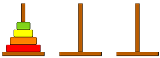

### A. Du cas particulier au cas général

- Comment résoudre le problème pour 2 disques ? *(le représenter sur le schéma ci-dessous)*
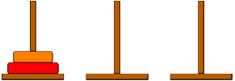 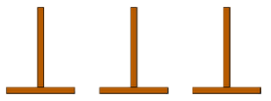  


- Résoudre le problème pour 3, 4 et 5 disques grâce à cette simulation : http://championmath.free.fr/tourhanoi.htm

- On considère une pile de `n` disques, et ***on suppose que l'on sait résoudre le problème pour `n-1` diques***. Représenter les étapes permettant de déplacer le `n`ème disque et la pile de `n-1` disques *(qui se déplace en entier, on suppose qu'on sait le faire)*, de manière à résoudre le problème :
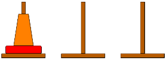   

- Récapituler les trois étapes de résolution du problème :
    - **Etape 1 :** 
    - **Etape 2 :**
    - **Etape 3 :**
    

### B. Algorithme

Pour résoudre le problème pour `n` disques, on fait appel, 2 fois, à la résolution du problème pour `n-1` disques. Nous allons donc utiliser un algorithme récursif.

On propose le *pseudo-code* suivant :

```python
fonction Hanoi(n, dep, inter, arr)
    ''' Affiche les déplacements pour résoudre le problème de Hanoï pour n disques
    
    Entrées : 
        n : entier représentant le nombre de disques à déplacer
        dep, inter, arr : caractères indiquant les sommets de départ, 
        intermédiaire et d'arrivée
    ''' 
    Si n est égal à 0
        retourner Rien
    Sinon
        Hanoi(.........................)
        afficher le déplacement depuis dep jusqu’à arr
        Hanoi(.........................)
```
Compléter le pseudo-code avec les bons paramètres pour les appels récursifs à la fonction `Hanoi`.

### C. Implémentation
- Ecrire l'implémentation en Python de cet algorithme ci-dessous :
```python


```
**N.B.:** Pour l'affichage, on peut utiliser une instruction du type :
```python
print("Déplacer le disque ", str(n), "de la tige ", dep, " vers la tige ", arr)
```
- Pour visualiser ce qu'il se passe, compléter le fichier Python fourni *(sur l'ENT)*.

<br><br>
---

## TP : Dessiner des fractales

Une **fractale** est un objet qui apparaît identique à différentes échelles : en "zoomant" sur une partie de la figure, on retrouve la figure initiale. On peut représenter une version approchée des fractales avec des programmes récursifs, dont on défini le niveau de récursion (donc le niveau de détails de la figure).

### 1. Des bulles

Le code suivant *(accessible sur l'ENT)* permet de dessiner une figure avec des bulles. Il utilise la bibliothèque `turtle` dont des éléments de documentation sont donnés dans le fichier.

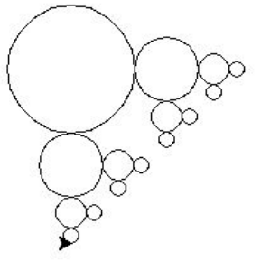

```python
from turtle import *

def dessine_cercle(x, y, r):
    up()
    goto(x,y-r)
    down()
    circle(r)
    return None

def bubble(n, x, y, r):
    if n == 0:
        return None
    else:
        dessine_cercle(x,y,r)
        bubble(n-1, x+3/2*r, y, r/2)
        bubble(n-1, x, y-3/2*r, r/2)
    return None

bubble(4,-100,100,50)
done()
```

1. Exécuter le code. Faire varier la valeur de `n` pour augmenter le niveau de détails de la figure.

2. Identifier les appels récursifs de la fonction `bubble`. 
    - Quel paramètre permet de réduire la taille des bulles au fur et à mesure ?
    - Quels paramètres changent la position de la tortue ?
    - La variation de quel paramètre nous assure que l'algorithme va se terminer ?


### 2. Le flocon de von Koch

Le **flocon de Von Koch** est une des premières courbes fractales à avoir été décrite. Elle a été inventée en 1904 par le mathématicien suédois Helge von Koch. Voici une partie de ce flocon :
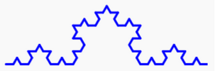

#### 2.A. Principe

- On commence par un segment de longueur `a`.  
- On coupe ce segment en 3 parties égales.  
- On remplace le segment central par un triangle équilatéral de côté `a/3`.
- Chaque segment de longueur `a/3` est lui-même découpé en 3 parties égales (chacune de longueur `a/9`).
- On remplace chaque partie centrale par un triangle équilatéral de côté `a/9`.
- etc.

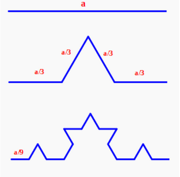

#### 2.B. Algorithme
Nous allons utiliser un algorithme similaire à celui qui permet de tracer le motif avec les bulles pour dessiner ce flocon. Compléter l'algorithme proposé :

```python
fonction fragment_flocon(n, cote): 

	ENTREES : 
	n : entier indiquant le nombre d’itération à faire 
	cote : la longueur du segment initial 

	Si n est égal à 0 alors 
		On trace le segment de longueur cote 
	Sinon 
		On appelle la fonction fragment_flocon avec les paramètres __________
		On tourne de _____ degrés sur la _______________
		___________________________________________________
		__________________________________________
		___________________________________________________
		__________________________________________
		___________________________________________________
```

#### 2.C. Implémentation

1. Implémenter l'algorithme en Python permettant de dessiner une partie du flocon.

2. Ecrire la fonction `flocon` dessinant le flocon en entier.
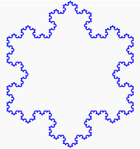
