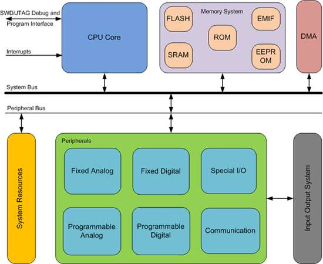

# **Séquence 3**
# Cours : Les systèmes sur puce

Pour simplifier les coûts, les concepteurs de circuits électroniques recherchent en permanence l’intégration maximale. L’objectif est d’implanter toutes les fonctions d’un syst`eme sur une seule puce. La difficulté vient de la diversité des technologies qui doivent cohabiter sur la même puce, sans interférer les unes avec les autres.

Ces systèmes se rencontrent dans l’informatique embarquée : dans les systèmes de traitement de l’information agissant de manière autonome. On parle de **systèmes sur puce** ou **SoC** de l’anglais **"System on a Chip"**.

## A. Présentation

A partir de la vidéo *"C'est pas sorcier : Nanomonde se secoue les puces"*, répondre aux questions suivantes :

- Quel est l'ordre de grandeur du nombre de composants que l'on trouve dans une puce ?   
- Combien de transistors faut-il pour inverser un courant (de 1 à 0 et de 0 à 1) ? Pour additionner des chiffres ?   
- Que dit la loi de Moore ?
  
- Quelle est l'ordre de grandeur de la taille d'un transistor en 2003 *(date de la vidéo)*  ?   

## B. Etude d’un exemple
Le schéma suivant décrit le SoC BCM2711 qui équipe les petits ordinateurs Raspberry Pi :

- Identifier les différents composants de l'architecture de von Neumann.
 

- Faire des recherches pour trouver les caractéristiques suivantes :
    - nombre de coeurs :
    - fréquence :
    - capacité de mémoire :
    - connectique :
    - réseau :
  

## C. Avantages et inconvénients
A partir de ce que vous avez vu dans le cours, et d'une recherche Web :  
- Lister les **avantages** d’un SoC.  
- Lister les **inconvénients** d’un SoC.  