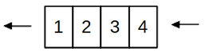
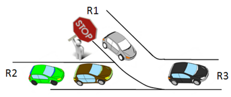

<style>
body {
text-align: justify}
</style>

# **Séquence 4**
# II. Les files

---

## Cours

### A. Définition

Une **file** est une structure de données basée sur le principe « premier entré, premier sorti » (en anglais *"First In, First Out"* (FIFO)), c’est-à-dire que les premiers éléments ajoutés à la file seront les premiers à être enlevés.



***Exemples*** de la vie quotidienne :  
- pour représenter le système de queue dans un magasin,  
- pour représenter le flux de véhicules sur une route,  
- pour stocker des dossiers en attente dans une entreprise,...

***Exemples*** en informatique :  
- ***pour la gestion du temps affecté à chaque tâche par un système d'exploitation,***  
- ***pour la gestion de la file d'attente de documents à imprimer,***  
- ***pour matérialiser une file d'attente d'un logiciel de visioconférence, d'un jeu en ligne,...***

### B. Type abstrait

Les opérations primitives que l'on peut faire sur une file sont les suivantes :  
- *construire* une file *vide* (`fileCree()`),  
- *ajouter* un élément à la file (il se retrouve après les autres) (`fileAjouterFin(file, element)`),  
- *enlever* un élément de la file (le premier ajouté : celui en tête) et le renvoie (`fileRetirerTete(file)`),  
- *estimer* si la file est *vide* (`True`) ou non (`False`) (`fileEstVide(file)`),  
- obtenir le *nombre d'éléments* contenus dans la file (`fileTaille(file)`),  
- obtenir la *tête* de la file, aussi appelé *sommet* (sans la retirer) (`fileTete(file)`).

***Exercice :*** En utilisant les noms des fonctions donnés ci-dessus,  créer une file, lui ajouter les éléments 2 et 9, puis lui enlever le dernier élément récupéré dans une variable, avant d'estimer si elle est vide. 

***Correction :***
```python
f = fileCree()
f = enfiler(f, 2)
f = enfiler(f, 9)
x = enfiler(f)
print(fileVide(f))
```

### C. Les structures linéaires de données

Les **listes**, **piles** et **files** sont des structures linéaires de données : c'est-à-dire que les différents éléments sont ordonnés et adjacents les uns aux autres.

Les **piles** et les **files** contrastent par leur ordre d'accès aux données est opposé : LIFO vs FIFO.

<br><br>

---

## TP : Implémentations

Dans ce TD, nous allons implémenter la **structure de file**, de plusieurs manières différentes.


### A. Une première implémentation
Une première implémentation est donnée ci-dessous.
A partir de ce code, créer une file et enfiler successivement les entiers de 0 à 4.


```python
def file():
    ''' Renvoie une file vide '''
    return []

def vide(f):
    ''' Renvoie True si la file est vide, False sinon '''
    return f == []

def enfiler(f,x):
    ''' Ajoute x à la file f '''
    return f.append(x)

def defiler(f):
    ''' Enlève et renvoie le premier élément de la file '''
    assert not vide(f), "file vide !"
    return f.pop(0)
```


```

```

Créer les fonctions suivantes :
- `taille` : renvoie la taille d'une file `f`,
- `sommet` : renvoie le sommet d'une file `f`, sans l'enlever de la file.
Les tester sur la file `f` créée précédemment.


```

```

### B. Implémentation avec deux piles

Pour la deuxième implantation, nous allons utiliser deux structures de piles et la programmation orientée objet.
Le procédé est le suivant :  
- La file est, au départ, composée de **deux piles** vides : une **pile d'entrée** et une **pile de sortie**.  
- Quand on **ajoute** un élément dans la file, on le place dans la **pile d'entrée**.  
- Quand on **supprime** un élément de la file, deux cas se présentent :  
    1. Si la pile de sortie est vide : on dépile alors chaque élément de la pile d'entrée pour les empiler dans la pile de sortie.  
    2. S'il y a au moins un élément dans la pile de sortie : on ne fait rien.  
    3. On supprime ensuite le sommet de la pile de sortie.
    
On utilise donc une classe `Pile`, et on propose la code de la classe `File` ci-dessous.  
- Compléter les méthodes proposées pour implémenter la structure de file.  
- Ajouter à la classe File les méthodes suivantes :  
    1. `sommet` : retourne le sommet de la file, sans l'en enlever.  
    2. `taille` : retourne le nombre d'éléments de la file.


```python
class Pile:
    ''' Définition d'une classe Pile
    une instance Pile est créée avec une liste Python '''
    
    def __init__(self):
        "Création d'une pile vide"
        self.L = []
        
    def vide(self):
        "Teste si la pile est vide"
        return self.L == []
    
    def depiler(self):
        "Dépile : enlève le dernier élément"
        assert( not(self.vide()) ), "Pile vide !"
        return self.L.pop()
    
    def empiler(self,x):
        "Empile : ajoute un élément x en haut de la pile"
        self.L.append(x)
        
    def taille(self):
        "Retourne la taille (le nombre d'éléments) de la pile"
        return len(self.L)
    
    def sommet(self):
        "Retourne le premier élément à sortir de la pile sans le dépiler"
        return self.L[self.taille()-1]


class File:
    
    def __init__(self):
        ''' Crée une file vide.
        Attribut pile_entree : objet Pile stockant les nouvelles valeurs ajoutées à la file.
        Attribut pile_sortie : objet Pile stockant les valeurs qui vont sortir de la file. Son sommet est le premier élément de la file.
        '''
        self.pile_entree = Pile()
        self.pile_sortie = Pile()
        
    def vide(self):
        ''' Teste si la file est vide ou non. '''
        return ???
    
    def enfiler(self, x):
        ''' Ajoute l'élément x à la file.'''
        self.pile_entree.empiler(x)
        
    def organiser(self):
        ''' Fonction auxiliaire actualisant l'état de la pile de sortie lorsque l'on veut supprimer un élément de la file. 
        Si la pile de sortie est vide, on lui ajoute successivement les éléments que l'on dépile à la pile d'entrée. '''
        if self.pile_sortie.vide():
            ???
        
    def defiler(self):
        ''' Supprime le premier élément entré dans la file. '''
        self.organiser()
        ???
            
        
```

Tester le bon fonctionnement du code suivant :


```python
f = File()
for i in range(5):
    f.enfiler(2*i)
print(f.taille())
a = f.defiler()
print(a)
print(f.taille())
print(f.sommet())
```

### C. Implémentation avec une liste Python

En vous inspirant de l'implémentation d'une pile en POO que nous avions faite, proposer une implémentation similaire pour une structure de file : en utilisant une liste Python. On devra retrouver les mêmes primitives que pour les autres implémentations. Faire un test en créant un nouvel objet File, et en lui appliquant les différentes méthodes.


```python
class File:
    
    # à compléter
```

### D. L'implémentation Python
Python possède sa propre implémentation de file, utilisable aussi pour modéliser une pile. Il s'agit de la structure **deque** ("double-ended queue").

Utiliser sa documentation : https://docs.python.org/fr/3/library/collections.html#collections.deque pour choisir les méthodes qui permettent de simuler le fonctionnement d'une file. On y retrouve des méthodes similaires à celles définies pour les listes Python, mais avec la possibilité d'ajouter et de supprimer des éléments soit à droite, soit à gauche.

Rajouter, à la suite du code ci-dessous, des instructions qui permettent de créer un objet `deque`, de lui enfiler plusieurs éléments, d'estimer si la file est vide, et de défiler un élément. Il y a plusieurs solutions.


```python
from collections import deque

```

<br><br>

---

## TD : Modélisation


### A. Présentation
On souhaite écrire un algorithme qui simule l'arrivée de voitures sur la route R3, modélisée par la file `f3`.  
- Dans la file `f1`, on représente la présence d’une voiture par le nombre `1` et l’absence de voiture par `0`.  
- Dans la file `f2`, on représentera la présence d’une voiture par le nombre `2` et l’absence de voiture par `0`.



Donner la file `f1` correspondant à la situation suivante : une voiture, pas de voiture, pas de voiture, une voiture, une voiture, pas de voiture.
<br><br>
Donner la file `f2` correspondant à la situation suivante : pas de voiture, pas de voiture, une voiture, une voiture, pas de voiture, une voiture.
<br><br><br>


### B.  Les différents cas
Que doit faire l’algorithme si :
- les deux sommets des files sont à `0` ?
<br><br>
- le sommet de `f1` est à `1` et celui de `f2` à `2` ?
<br><br>
- le sommet de `f1` est à `1` et celui de `f2` à `0` ?
<br><br>
- le sommet de `f1` est à `0` et celui de `f2` à `2` ?
<br><br>
- l’une des deux files est vide ?
<br><br>
<br>

Donner la file `f3` correspondant aux files entrantes suivantes :  
`f1` : tête <– [0, 1, 1, 0, 1] <– queue  
`f2` : tête <– [0, 2, 2, 2, 0, 2, 0] <– queue
<br><br><br><br><br>

### C. Construction de l’algorithme
Ecrire sous la forme d’un pseudo-code la fonction `croisement` prenant en entrées les deux files `f1` et `f2`, et retournant la file `f3`. Tous les cas identifiés dans la partie précédente devront être traités. On n’utilisera que les primitives utilisables sur les files.

```python


```


### D. Implémentation de l’algorithme
Implémenter le pseudo-code précédent et le tester sur l’exemple donné dans la partie 2. On utilisera une implémentation de file avec la POO, utilisant les méthodes `enfiler`, `defiler`, `sommet` et `estVide`.